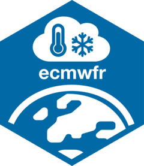

# ecmwfr 

[](https://github.com/bluegreen-labs/ecmwfr/actions)
[](https://codecov.io/gh/bluegreen-labs/ecmwfr)
[](https://cran.r-project.org/package=ecmwfr)
[](https://www.repostatus.org/#active)
[](https://cran.r-project.org/package=ecmwfr)
[](https://zenodo.org/badge/latestdoi/156325084)

Programmatic interface to the two [European Centre for Medium-Range
Weather Forecasts](https://www.ecmwf.int/) API services. The package

provides easy access to all available Data Stores from within R, matching and
expanding upon the ECMWF python tools. Support is provided for the 
[Climate Data Store](https://cds-beta.climate.copernicus.eu), the 
[Atmosphere Data Store](https://ads.atmosphere.copernicus.eu) and the
[Early Warning Data Store](https://cds.climate.copernicus.eu) (from the 
Copernicus Emergency Management Services).

## How to cite this package

You can cite this package like this "we obtained data from the European
Centre for Medium-Range Weather Forecasts API using the ecmwf R package
(Hufkens, Stauffer, and Campitelli 2019)". Here is the full
bibliographic reference to include in your reference list (don't forget
to update the 'last accessed' date):

> Hufkens, K., R. Stauffer, & E. Campitelli. (2019). ecmwfr:
> Programmatic interface to the two European Centre for Medium-Range
> Weather Forecasts API services. Zenodo.
> <http://doi.org/10.5281/zenodo.2647531>.

## Installation

### stable release

To install the current stable release use a CRAN repository:

``` r
install.packages("ecmwfr")
library("ecmwfr")
```

### development release

To install the development releases of the package run the following
commands:

``` r
if(!require(remotes)){install.packages("remotes")}
remotes::install_github("bluegreen-labs/ecmwfr")
library("ecmwfr")
```

Vignettes are not rendered by default, if you want to include additional
documentation please use:

``` r
if(!require(remotes)){install.packages("remotes")}
remotes::install_github("bluegreen-labs/ecmwfr", build_vignettes = TRUE)
library("ecmwfr")
```

## Use: ECMWF Data Store services

Create a ECMWF account by [self
registering](https://accounts.ecmwf.int/auth/realms/ecmwf/login-actions/registration?client_id=cms-www&tab_id=-Wuo-QeT0_k). Once your user account has been verified you can get your personal access token or *key* by visiting one of the Data Stores user profiles, for example the CDS [user profile](https://cds-beta.climate.copernicus.eu/profile). 

The Personal Access Token is a long string of letters and numbers:

``` json
Personal Access Token: abcd1234-foo-bar-98765431-XXXXXXXXXX
```
This Personal Access Token gives you access to all Data Store services, including the climate atmosphere and emergency management services. This information is required to be able to retrieve data via the `ecmwfr` package. Use the
`ecmwfr` [`wf_set_key`](references/wf_set_key.html) function to store
your login information in the system keyring (see below).

### Setup

You have to save your login information before proceeding. The
package does not allow you to use your key inline in scripts to limit
security issues when sharing scripts on github or otherwise. **The following
lines should NEVER be included in any script and run only once at setup.**

``` r
# set a key to the keychain
wf_set_key(key = "abcd1234-foo-bar-98765431-XXXXXXXXXX")

# you can retrieve the key using
wf_get_key()

# the output should be the key you provided
# "abcd1234-foo-bar-98765431-XXXXXXXXXX"

# Alternatively you can input your login info with an interactive request
# if you do not put in the key directly
wf_set_key()

# you will get a command line request to provide the required details
```

Before you can download any data you have to make sure to accept the
terms and conditions here: Before downloading and processing data from
CDS please make sure you accept the terms and conditions in the profile
pages of your Data Store of choice.

### Data Requests

To download data use the [`wf_request`](references/wf_request.html)
function, and a request string syntax. The simplest way to get the requests is 
to go to the Data Store website which offers an interactive interface to create
these requests e.g., for the CDS ERA-5 reanalysis data:

-   [ERA-5 at pressure level data](https://cds-beta.climate.copernicus.eu/datasets/reanalysis-era5-pressure-levels?tab=download)
-   [ERA-5 land](https://cds-beta.climate.copernicus.eu/datasets/reanalysis-era5-land?tab=download)
-   ...

After formatting the request online copy the API request python code to your script.
The request should include the _dataset_, _request_ and _target_ field (if available).


Instead of `json` formatting as shown in the online form the `ecmwfr` package 
uses a _R_ lists for all the arguments. This makes changing variables less prone
to error, although overall we suggest not to manually create requests and use
the RStudio Addin to translate the python `json` request to _R_ as shown below.

Just select the whole query, including the dataset and target fields, and click
on the Addins > ECMWF Python to list. The original python query is listed below
so you can try this routine yourself.


```python
# The full python query, which you can translate to an R
# list using the Addin

dataset = "reanalysis-era5-pressure-levels"
request = {
  'product_type': ['reanalysis'],
  'variable': ['temperature'],
  'year': ['2000'],
  'month': ['04'],
  'day': ['04'],
  'time': ['00:00'],
  'pressure_level': ['850'],
  'data_format': 'netcdf',
  'download_format': 'unarchived',
  'area': [70, -20, 60, 30]
}
```

This will give you a request as an annotated list. If no target file is
specified in the original request a _target_ field will be added to the list
with a default name `TMPFILE`. Replace this filename with something that matches
your preference and the specified data format. In this case the default name
was changed to `era5-demo.nc`, a netcdf file. This formatted request can now be
used by the [`wf_request`](references/wf_request.html) function to query and download the
data. By default the process is verbose, and will give you plenty of feedback
on progress.

``` r
# This is an example of a request as converted from 
request <- list(
  dataset_short_name = "reanalysis-era5-pressure-levels",
  product_type = "reanalysis",
  variable = "temperature",
  year = "2000",
  month = "04",
  day = "04",
  time = "00:00",
  pressure_level = "850",
  data_format = "netcdf",
  download_format = "unarchived",
  area = c(70, -20, 60, 30),
  target = "era5-demo.nc"
)

# If you have stored your user login information
# in the keyring by calling cds_set_key you can
# call:
file <- wf_request(
 request  = request,  # the request
 transfer = TRUE,     # download the file
 path     = "."       # store data in current working directory
 )
```

The Data Store services are quite fast, however, if you request a lot of
variables, multiple levels, and data over several years these requests
might take quite a while! You can check the scope of your query and if
it is out of bounds in the right hand `Request Validation` panel when
formatting your original data request in the web interface.

**Note**: If you need to download larger
amounts of data it is suggested to split the downloads, e.g., download
the data in chunks (e.g., month-by-month, or year-by-year). A progress
indicator will keep you informed on the status of your request. Keep in
mind that all data downloaded will be buffered in memory limiting the
downloads to \~6GB on low end systems.

#### ERA5 demo 

The above request uses ERA-5 reanalysis data on pressure levels.

* `dataset`: downloading ERA-5 reanalysis on pressure level(s)
* `product_type`: (deterministic) reanalysis data
* `variable`/`pressure_level`: requesting temperature on 850 hectopascal
* `year`/`month`/`day`: April 4, 2000 (one day in this example)
* `time`: valid at 00:00 UTC (date/time always in UTC),
* `area`: custom subset covering northern Europe
* `format`: output format NetCDF
* `target`: local output file `era5-demo.nc`

The data set as specified above can be downloaded calling the
`wf_request` function, and upon request returns the location of the 
NetCDF file on your system. The `file` variable can then be used directly
for further processing (note: should the download be interupted the job ID in your
download queue is returned and the job can be resumed using `wf_transfer()`).

Once the retrieval has finished you should now be the owner of a NetCDF containing
the requested information located in the current working directory, called `era5-demo.nc`.

We can quickly visualize this data using the `terra` geospatial library using:

```r
# Open NetCDF file and plot the data
# (trap read error on mac - if gdal netcdf support is missing)
r <- terra::rast(file)
terra::plot(r, main = "ERA-5 Reanalysis Demo (2m Temperature 850 hPa)")
maps::map("world", add = TRUE)
```


## File and system based keychains

On linux you can opt to use a file based keyring, instead of a GUI based
keyring manager. This is helpful for headless setups such as servers.
For this option to work linux users must set an environmental option.

``` r
options(keyring_backend="file")
```

You will be asked to provide a password to encrypt the keyring with.
Upon the start of each session you will be asked to provide this
password, unlocking all `ecmwfr` credentials for this session. Should
you ever forget the password just delete the file at:
`~/.config/r-keyring/ecmwfr.keyring` and re-enter all your credentials.

Alternatively, you can set an environmental containing your Personal Access Token. 

```r
 Sys.setenv(ecmwfr_PAT="abcd1234-foo-bar-98765431-XXXXXXXXXX")
```

This will need to be set at the beginning of each setting or added to the user
`.Renviron` file. Overall,  this is considered insecure, but might be the only 
option on some legacy or HPC systems to get full `ecmwfr` functionality. A good 
blog post on why you should not do this is 
provided by [Maëlle Salmon](https://blog.r-hub.io/2024/02/28/key-advantages-of-using-keyring/).

## Date specification

For those familiar with the old ECMWF *mars* syntax: CDS/ADS/CEMS does not accept
`date = "2000-01-01/to/2000-12-31"` specifications. It is possible to
specify one specific date via `date = "2000-01-01"` or multiple days via
`date = ["2000-01-01","2000-01-02","2000-10-20"]` or
`date = "YYYY-MM-DD/YYYY-MM-DD"`.

## Citation

Hufkens, K., R. Stauffer, & E. Campitelli. (2019). ecmwfr: Programmatic
interface to the two European Centre for Medium-Range Weather Forecasts
API services. Zenodo. <http://doi.org/10.5281/zenodo.2647531>.

## Acknowledgements

This project is maintained by BlueGreen Labs (BV). This project was in the past
partially supported by the Belgian Science Policy office
COBECORE project (BELSPO; grant BR/175/A3/COBECORE), a "Fonds voor
Wetenschappelijk Onderzoek" travel grant (FWO; V438318N) and the Marie
Skłodowska-Curie Action (H2020 grant 797668). Logo design elements are
taken from the FontAwesome library according to [these
terms](https://fontawesome.com/license), where the globe element was
inverted and intersected.
